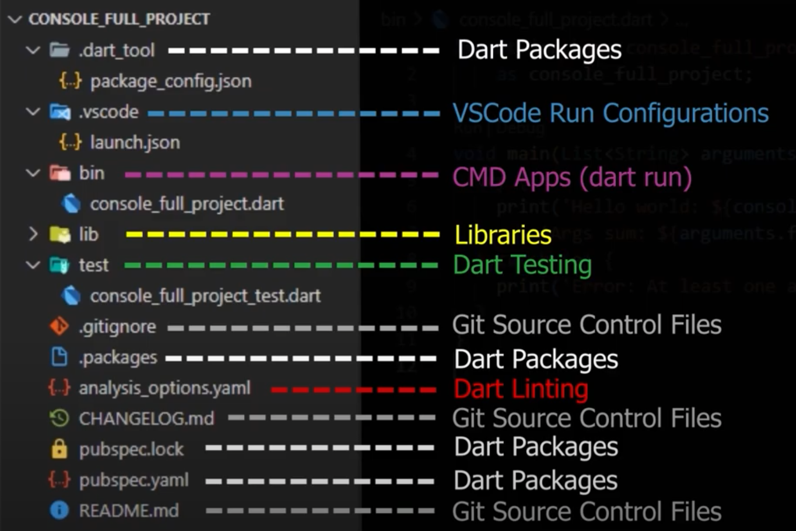

# Dart

## Intro

-   Dart is **type safe** - the only operations that can be performed on data in the language are those allowed by the type of the data
-   **Static type check** (Compile time) _"Local check"_
-   **Runtime check** (Run time) _"Additional check"_
    -   assign **dynamic** type to a variable -> no static type checks but there's runtime checks, will throw runtime exception
-   types are mandatory but don't have to be annotated because Dart can infer types using the var keyword

## Dynamic vs var

-   if declared dynamic, can set to other types
-   var -> type inference, cannot change to other types after first declaration e.g. `var b = 1.0`
-   `var a;` -> `dynamic a`

## Dart Compiler

-   Development Phase: **Just In Time (JIT) Compiler** compiles just the amount of code it needs, does not recompile the already compiled code if it hadn't changed
    -   responsible for **hot-reload**
-   Production Phase: **Ahead of Time Compiler**: compiles the entire code before each build
    -   compiles entire source code into platform specific machine code
    -   makes sure the build is the best most optimal version of it

## Dart SDK

-   SDK = Software Development Kit
    -   Compilers, Debuggers, Analyzers, Libraries, The Software Framework
-   **Stable Channel** (stable releases) suitable for production use
-   **Beta Channel** (preview releases)
-   **Dev Channel** (prereleaes)

## Components of a Dart project

-   **Dart Packages**: main component of Dart ecosystem
    -   directory containing at minimum a `pubspec.yaml` file
    -   Dart ecosystem uses packages to manage shared software (libraries & tools)
    -   in order to get and manage packages, use pub package manager

## Dependencies

-   _Your Package <- Package A <- Package B <- Package C_
-   Package A = **Immediate Dependency**
-   Package B & C = **Transitive Dependency**
-   **Regular Dependencies** = development & production phase
-   **Dev Dependencies** = development phase

## Code Objectives

-   How & when to format
-   Function & variable naming
-   When you'll refactor
-   How to structure files & directories

**Write minimalist & simple to understand code**

-   smarter, simpler to understand, more performance efficient

**Always test code.**

-   medium to big projects should always use tests.
-   Feature A -> Test A

## Sound Null Safety

-   it is unsafe to have one or multiple null values flowing untracked in an app
-   errors related to the safety of null should be shown at edit-time, and not at run time, where it may be too late
-   sound -> if type system determines that something is not null, then that thing can never be null -> smaller binaries, faster execution
-   null safety's goal is not to eliminate the null from the equation. null will still exist in every Dart program. null highlights the "absence" of a value. the issue is not null itself, but rather having null where you don't expect it
-   null safety's goal is to have control into where, how, and when null can flow through your program
-   types are made **nullable** by postfixing them with the **question mark (?)** e.g. `String?, int?, double? num?, List<int?>`
-   `String?` = String or Null type
-   **TL;DR: we will never get null reference error unless we ask for them**
-   null assertion operator `!`

## Dart Variables

Recap:

-   Dart is an Object Oriented Programming (OOP) Language
    -   Mostly everything in Dart is a class, and objects are instances of these classes
    -   1, 2.0, 'example', [1,2,3], test(), null are objects
-   Everything you place inside a Dart's variable is an object => an instance of a class. e.g. `int a = 5`, 5 is an object instantiated from the integer class.
-   Dart is a strongly typed language meaning that everything has a type.
-   Explicit Type annotations are optional; Dart is able to infer types
    -   var keyword @compile-time, dynamic keyword @run-time
    -   `var a = 5;` -> variable a is of type integer
    -   `dynamic b = 5;` -> variable b is of type dynamic, only at runtime it is set to integer
-   Dart is a sound typed system, it can't never evaluate into an unknown state
-   Variables can't contain null, unless you say they can
    -   `int a;` -> non-nullable. must be integer
    -   `int? a;` -> nullable. might be an integer or null
    -   `int? nullableButNotNull = 2;`
    -   `int a = nullableButNotNull!`
    -   another example:
        -   `String? nullableString`;
        -   `String nonNullableString`;
        -   to assign nullableString to nonNullableString: `nonNullableString = nullableString!`
-   Dart is an ecosystem based on packages
-   Dart packages can depend on one another
-   Dart packages use libraries to share code with one another
-   Libraries are stored inside `lib` folder
-   Files outside `lib` folder are not shared with other packages
