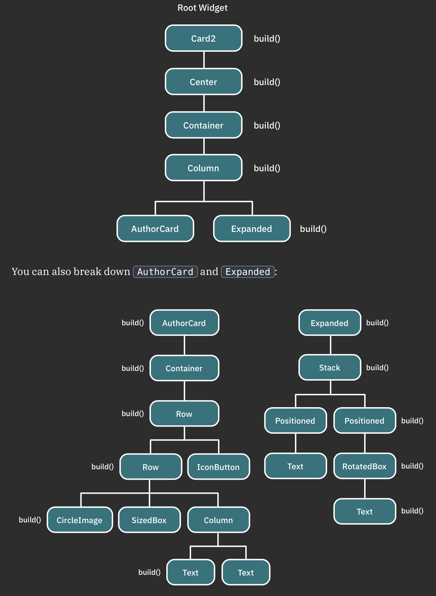

# Understanding Widgets

## What is a widget?

A widget is a building block for your user interface. Using widgets is like combining Legos.

## UI = f(state)

Think of widgets as a function of UI. Given a state, the build() method of a widget constructs the widget UI (screen).

## Examples

-   **Container widget**: styles, decorates and positions widgets.
-   **Column widget**: displays other widgets vertically.
-   **Custom widget**: display custom info.
-   **Expanded widget**: use a widget to fill the remaining space.
-   **Stack widget**: place widgets on top of each other.
-   **Positioned widget**: controls a widget's position in the stack.

## Widget trees

-   Every widget contains a build() method
-   In the build() method, create a UI composition by nesting widgets within other widgets
-   Forming a tree-like data structure.
-   Each widget can contain other widgets, commonly called children.
-   Widget tree provides a blueprint that describes how you want to lay out your UI
-   The framework traverses the nodes in the tree and calls each build() method to compose entire UI

## Flutter's architecture

-   Framework (Dart)
    -   **Material or Cupertino** are UI control libraries built on top of the widget layer, they make UI look and feel like Android and iOS apps, respectively.
    -   **Widgets** layer is a composition abstraction on widgets, containing all primitive classes needed to create UI controls.
    -   **Rendering** layer is a layout abstraction that draws and handles the widget's layout.
    -   **Foundation** aka dart:ui layer contains core libraries that handle animation, painting and gestures.
-   Engine (C/C++)
-   Embedder (Platform-specific)

## Flutter manages 3 trees in parallel

1. **Widget**: public API or blueprint for the framework. Developers usually just deal with composing widgets.
2. **Element**: manages a widget and a widget's render object. for every widget instance in the tree, there is a corresponding element.
3. **RenderObject**: responsible for drawing and laying out a specific widget instance. also handles user interactions like hit-testing and gestures.

The element tree manages each widget instance and associates a render object to tell the framework how to render a particular widget.

## Types of elements

1. **ComponentElement**: composed of other elements. corresponds to composing widgets inside other widgets
2. **RenderObjectElement**: holds render object

Think of **ComponentElement** as a group of elements, and **RenderObjectElement** as a single element. Each element contains a render object to perform widget painting, layout and hit testing.

## Types of widgets

-   **Stateless**
    -   state/properties cant be altered once it's built
    -   constructor (you pass params) -> build() method (you override)
    -   widget updates when:
        -   inserted into the widget tree for the first time
        -   state of a dependency or inherited widget - ancestor nodes - changes
-   **Stateful**
    -   preserve state, which is useful when parts of UI need to change dynamically
    -   assign build context to the widget, internal flag `mounted` is set to `true`, this lets the framework know that this widget is currently on the widget tree
    -   `initState()` is the first method called after a widget is created, similar to onCreate() in android or viewDidLoad() in iOS
    -   calls `didChangeDependencies()` the first time the framework builds a widget.
        -   might call this again if state object depends on an inherited widget that has changed.
    -   calls `build()`. which is called everytime a widget needs rendering.
        -   every widget in the tree triggers a `build()` method recursively, so this operation has to be very fast.
        -   `build()` should never do anything that's computationally demanding. heavy computational functions should be performed asynchronously. this is similar to iOS or Android main thread, where network calls are never done as it stalls the UI rendering
    -   framework calls ` didUpdateWidget(_)` when a parent widget makes a change or needs to redraw the UI. when that happens, you'll get the ` oldWidget` instance as a parameter so you can compare it with your current widget and do any additional logic.
    -   to modify the state in your widget, call ` setState()`. the framework marks the widget as `dirty` and triggers a `build()` again
        -   asynchronous code should always check if the ` mounted` property is true before calling `setState()` because the widget may no longer be part of the widget tree
    -   when remover object from the tree -> framework calls `deactivate()`. the framework can in some cases reinsert the state object into another part of the tre
    -   calls ` dispose()` when you permanently remove the object and its state from the tree.
        -   important method in handling memory cleanup, such as unsubscribing streams and disposing of animations or controllers
        -   rule of thumb for ` dispose()` is to check any properties you define in your state and make sure you've disposed of them properly
-   **Inherited**
    -   allows the access of state information from parent elements in the tree hierarchy.
    -   centralised way of accessing data instead of passing data down as a parameter on each nested widget
    -   by adding an inherited widget in your tree, you can reference the data from any of its descendants. this is known as **lifting state up**
    -   use cases:
        -   accessing a Theme object to change the UI's appearance
        -   calling API service object to fetch data from the web
        -   subscribing to streams to update the UI according to the data received

Always start by creating **StatelessWidget** and only use **StatefulWidgets** when you need to manage and maintain the state of your widget.
